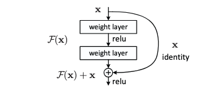
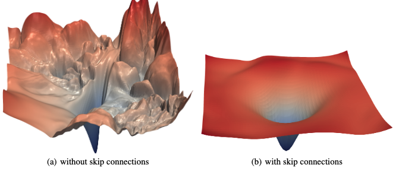

# Deep Residual Learning for Image Recognition
Notes on residual networks and implementation details in Pytorch

### Background

Residual Networks (ResNets) were introduced in the paper [Deep Residual Learning for Image Recognition](https://arxiv.org/pdf/1512.03385). The paper was released about a decade ago into a vastly different AI landscape. The [ImageNet](https://www.image-net.org/) dataset had just been released a few years earlier and researchers were hard at work inventing new methods to improve performance. Up until this point, model architectures were still relatively shallow but there was a strong belief larger and deeper networks could improve performance. But, there were several challenges that arose when training deeper models that prevented models from converging.

Vanishing or exploding gradients were one common issue. Neurons earlier in the network impact  the output of subsequent neurons and consequently the gradients that influence how earlier neuron should be updated during backpropagation is a product of gradients of subsequent neurons. As network depth increases, more gradients are multiplied together, and if these gradients are very small, close to 0, or very large, greater than 1, then the product can vanish or explode, hindering model learning. This issue was addressed with improved weight initialisation methods and by introducing normalisation techniques like batch normalisation to control the size of the weights of the network during training. 

Despite this, the authors still noticed that deep networks were difficult to train. Specifically they stated that `with the network depth increasing, accuracy gets saturated and then degrades rapidly`. This was empirically determined and the authors hypothesised that deeper models struggled to learn Identity functions. Quoting directly from the paper:

> The degradation (of training accuracy) indicates that not all systems are similarly easy to optimize. Let us consider a shallower architecture and its deeper counterpart that adds more layers onto it. There exists a solution by construction to the deeper model: the added layers are identity mapping, and the other layers are copied from the learned shallower model. The existence of this constructed solution indicates that a deeper model should produce no higher training error than its shallower counterpart. But experiments show that our current solvers on hand are unable to find solutions that are comparably good or better than the constructed solution.
> 

### Key Idea

The main hypothesis was that neural networks struggled to learn identity functions which meant that shallower networks would often outperform deeper networks. To overcome this, a residual connection was introduced that added the ability for the network to model an identity function. This was simply done by combining the layer’s initial input with the activated input as shown below. 



*Basic block from ‘Deep Residual Learning for Image Recognition’ (He 2015)*

Without the residual connection the network learns `H(x) = F(x) - x`. With it, the neural network learns `F(x)`. And if an identity function is required, the network could learn to minimise `F(x)~0`, so that the output of the entire layer is just `x`. Subsequent studies by [Li (2017)](https://arxiv.org/pdf/1712.09913), visually showed that residual connections smoothen the loss surfaces making it easier to train the system.



*From ‘Visualizing the Loss Landscape of Neural Nets’ (Li 2017)*

### Implementation

To test their ideas, the authors built and evaluated extremely deep networks on image classification challenges. The networks were often several tens of layers deep. Here I just concentrate on replicating the model developed for the [CIFAR-10 dataset](https://www.cs.toronto.edu/~kriz/cifar.html), which is a dataset of 32x32 images mapped to 10 classes.


The data can be loaded with the following functions 

```python
def unpickle(file):
    with open(file, "rb") as fo:
        data = pickle.load(fo, encoding="bytes")
    data = {bytes.decode(k): v for k, v in data.items()}
    return data

def load_images(filename: str) -> tuple[Sequence[np.uint8], Sequence[np.uint8]]:
    data = unpickle(filename)
    
    # keys are bytes
    images = np.array(data["data"], dtype=np.uint8)
    images = images.reshape(len(images), 3, 32, 32)
    labels = np.array(data["labels"], dtype=np.uint8)
    return images, labels
    
# Images are pixel values 0-255
images, labels = load_images("../datasets/cifar-10-batches-py/data_batch_1")
label_metadata = unpickle("../datasets/cifar-10-batches-py/batches.meta")
label_names = [bytes.decode(label) for label in label_metadata["label_names"]]
```

and plotted with matplotlib

```python
def display_image(image: Sequence[np.uint8], label: int, label_names: list[str]) -> None:   
    """ Given an image (C, H, W) plot with title """
    plt.imshow(np.transpose(image, (1, 2, 0)))
    plt.title(label_names[label])
    plt.plot()
```

**Model Architecture**

We’ll start with the entire model architecture and then circle back to the residual block which was shown above. The model is in essence a series of convolutional layers followed by dense layers. These convolutional layers increase the number of channels of the input whilst simultaneously decreasing the size of the image. 

The input is initially passed through a convolutional layer and then three stages of stacked residual layers to increase the number of channels and decrease the image size. There are `2n` residual blocks per (image, channel) size.

| Image Size | 32x32 | 16x16 | 8x8 |
| --- | --- | --- | --- |
| Layers | 1+2n | 2n | 2n |
| Channels | 16 | 32 | 64 |

Figure 3 in the paper is a nice diagram of the architecture. The first layer is a 3x3 convolution which increases the channels to 16 but does not change the image size. This is implemented by setting stride = 1. This layer is followed by an activation layer and batch normalisation layer.

```python
class Resnet(nn.Module):

    def __init__(
        self,
        in_channels: int,
        out_channels: list[int],
        blocks: int,
        input_kernel_size: int,
        block_kernel_size: int,
        block_layers: int,
        shortcut_method: str,
        n_classes: int,
        batch_norm: bool = True,
    ):
        super().__init__()
        self.conv1 = nn.Conv2d(
            in_channels, out_channels[0], kernel_size=input_kernel_size, stride=1, padding=1
        )
        self.act1 = nn.ReLU()
        self.norm1 = nn.BatchNorm2d(out_channels[0])
```

Next we create the `2n` residual blocks for each step change in image size and channel size. The number of channels

```python
self.residual_blocks = []
in_channels = out_channels[0]
for i, out_channel in enumerate(out_channels):
    self.residual_blocks.append(
        ResidualBlock(
            in_channels,
            out_channel,
            kernel=block_kernel_size,
            layers=block_layers,
            stride=2 if i > 0 else 1,  # First set of blocks do not change size,
            shortcut_method=shortcut_method,
            batch_normalise=batch_norm,
        )
    )
    in_channels = out_channel
    for _ in range(blocks - 1):
        self.residual_blocks.append(
            ResidualBlock(
                in_channels,
                out_channel,
                kernel=block_kernel_size,
                layers=block_layers,
                stride=1,
                shortcut_method=shortcut_method,
                batch_normalise=batch_norm,
            )
        )

self.residual_blocks = nn.ModuleList(self.residual_blocks)
```

This just represents something like the following, which is taken from the original paper.


*Snapshot of residual blocks from original paper*

First, the number of input channels into the first block is equal to the number of output channels of the first convolution layer `in_channels = out_channels[0]` . Next, for each step change in output channels, we create 2n residual blocks. `n` is given by the `blocks` parameter, and `2` is the number of layers in one residual layer. 

So we loop through each channel size and then the number of blocks. The first residual layer, changes the number of channels and the size of the image (see dotted lines). The change in size is handled by using stride = 2. The rest of the `n - 1` blocks have the same number of channels and image size.

Finally, following the residual layers, there’s a 2D pooling layer and a dense layer for classification. The output shape following the pooling layer is (Batch, Channels, 1, 1). Here we use lazy layers which figure out the properties needed to reshape the input into the desired output.

```python
self.pool = nn.AdaptiveAvgPool2d(1)
self.out = nn.LazyLinear(n_classes)
```

Bringing this altogether, the forward pass is then

```python
def forward(self, x: torch.Tensor):
    x = self.act1(self.norm1(self.conv1(x)))
    for layer in self.residual_blocks:
        x = layer(x)

    x = self.pool(x)
    x = x.view(x.size(0), -1) # Flatten for dense layer
    return self.out(x)

```

**Residual Block**

The residual block is a composition of multiple convolutional layers and the skip connection. In the paper they describe two types of residual blocks: basic block and bottleneck block. I only implemented the basic block. The bottleneck block simply sandwiches a large-kernel convolution between two smaller 1x1 convolutions. 

The basic block is described in the paper as two 3x3 convolutional layers followed by the output concatenated with the input. In theory, there could be many more than 2 layers and so in this implementation, I set that as a parameter. 

```python
class ResidualBlock(nn.Module):

    def __init__(
        self,
        in_channels: int,
        out_channels: int,
        kernel: int,
        layers: int,
        stride: int,
        shortcut_method: str = "projection",
        batch_normalise: bool = True,
    ):
        """
        in_channels : Number of input channels
        out_channels : Number of output channels
        kernel : Kernel size for the convolution
        layers : Number of layers in the block
        stride : Stride for the first convolution
        shortcut_method : Method to handle the residual connection, either "projection" or "pad"
        batch_normalise : Whether to add batch normalisation after each convolution
        """
        super().__init__()
        assert shortcut_method in ["projection", "pad"]
```

There are two more parameters to draw attention to: stride and `shortcut_method`. Some blocks in the Resnet project the input down to a smaller size and increase channel size. The downward projection is accomplished by setting stride = 2 and for the rest stride = 1. This parameter is only modifies the stride value of the first convolution layer within a block. We’ll talk about the shortcut_method a bit later on.

We create the layers of the residual block as follows:

```python
self.layers = []
self.layers.append(
    ResidualCNNLayer(
        in_channels,
        out_channels,
        kernel=kernel,
        stride=stride,
        batch_normalise=batch_normalise,
        add_activation=True,
    )
)

for _ in range(1, layers - 1):
    self.layers.append(
        ResidualCNNLayer(
            out_channels,
            out_channels,
            kernel=kernel,
            stride=1,
            batch_normalise=batch_normalise,
            add_activation=True,
        )
    )

# Don't add ReLU to final layer. This happens after residual is added
self.layers.append(
    ResidualCNNLayer(
        out_channels,
        out_channels,
        kernel=kernel,
        stride=1,
        batch_normalise=batch_normalise,
        add_activation=False,
    )
)
self.layers = nn.ModuleList(self.layers)
```

and each ResidualCNNLayer is defined as

```python
class ResidualCNNLayer(nn.Module):
    def __init__(
        self,
        in_channels: int,
        out_channels: int,
        kernel: int,
        stride: int,
        batch_normalise: bool,
        add_activation: bool,
    ):
        """
        in_channels : Number of input channels
        out_channels : Number of output channels
        kernel : Kernel size for the convolution
        stride : Stride for the convolution
        batch_normalise : Add batch normalisation after the convolution
        add_activation : Add activation function after covolution or batch normalisation
        """
        super().__init__()
        self.conv = nn.Conv2d(
            in_channels,
            out_channels,
            kernel_size=kernel,
            stride=stride,
            bias=False,
            padding=1,
        )
        self.norm = nn.BatchNorm2d(out_channels) if batch_normalise else nn.Identity()
        self.act = nn.ReLU() if add_activation else nn.Identity()

    def forward(self, x: torch.Tensor) -> torch.Tensor:
        return self.act(self.norm(self.conv(x)))
```

The first layer and last layer are separated as they require special handling (in our simple example these are the only layers). Again, the first layer sometimes has a stride = 2 or 1, depending on if the block is the first or subsequent block for particular channel group of blocks. The last layer in the residual block, is separated because the activation function is added after concatenation.

Finally, we return to the `shortcut_method` . This is used to control how the skip-connection adapts the size of the input. In most blocks, the input along the skip-connection path is unchanged and simply added to the outputs of the convolutional layers. However, when the convolutional layers change the channels and size, the skip-connection input also needs to be changed to have matching dimensions. The paper describes two options for this:

1. Project the input with a convolutional layer
2. Subsample the layer to reduce feature map size and pad to increase the channel dimensions. In practice, the subsampling layer can be any type of pooling layer with a stride = 2 (both max and average pooling with kernel size = 1, return the same result). The code for this is below

```python
class ShortcutPadLayer(nn.Module):
    """Pad the channels with zeros when shortcut"""

    def __init__(self, out_channels: int):
        super().__init__()
        self.out_channels = out_channels
        self.pool = nn.AvgPool2d(kernel_size=1, stride=2)

    def forward(self, x: torch.Tensor) -> torch.Tensor:
        x = self.pool(x)
        batch, input_channels, h, w = x.shape
        # Copy original channels to first part
        padded = torch.zeros(batch, self.out_channels, h, w, dtype=x.dtype, device=x.device)
        padded[:, :input_channels, :, :] = x
        return padded
```

In our Residual Block we can toggle between these as follows where `out_channels > in_channels` tells us when a change to the input is required.

```python
if out_channels > in_channels:
    if shortcut_method == "projection":
        # Reduce feature map size of input
        self.residual_projection = nn.Conv2d(
            in_channels, out_channels, kernel_size=1, stride=2
        )
    else:
        self.residual_projection = ShortcutPadLayer(out_channels)

self.final_act = nn.ReLU()
```

Bring this altogether in the forward pass, we have

```python
def forward(self, x: torch.Tensor) -> torch.Tensor:
    residual = self.residual_projection(x)
    for layer in self.layers:
        x = layer(x)
    return self.final_act(x + residual)
```

And that’s it. Bringing everything together, we have the final Resnet from above

```python
class Resnet(nn.Module):

    def __init__(
        self,
        in_channels: int,
        out_channels: list[int],
        blocks: int,
        input_kernel_size: int,
        block_kernel_size: int,
        block_layers: int,
        shortcut_method: str,
        n_classes: int,
        batch_norm: bool = True,
    ):
        super().__init__()
        self.conv1 = nn.Conv2d(
            in_channels, out_channels[0], kernel_size=input_kernel_size, stride=1, padding=1
        )
        self.act1 = nn.ReLU()
        self.norm1 = nn.BatchNorm2d(out_channels[0])
        self.residual_blocks = []
        in_channels = out_channels[0]
        for i, out_channel in enumerate(out_channels):
            self.residual_blocks.append(
                ResidualBlock(
                    in_channels,
                    out_channel,
                    kernel=block_kernel_size,
                    layers=block_layers,
                    stride=2 if i > 0 else 1,  # First set of blocks do not change size
                    shortcut_method=shortcut_method,
                    batch_normalise=batch_norm,
                )
            )
            in_channels = out_channel
            for _ in range(blocks - 1):
                self.residual_blocks.append(
                    ResidualBlock(
                        in_channels,
                        out_channel,
                        kernel=block_kernel_size,
                        layers=block_layers,
                        stride=1,
                        shortcut_method=shortcut_method,
                        batch_normalise=batch_norm,
                    )
                )

        self.residual_blocks = nn.ModuleList(self.residual_blocks)
        self.pool = nn.AdaptiveAvgPool2d(1)
        self.out = nn.LazyLinear(n_classes)

    def forward(self, x: torch.Tensor):
        x = self.act1(self.norm1(self.conv1(x)))
        for layer in self.residual_blocks:
            x = layer(x)

        x = self.pool(x)
        x = x.view(x.size(0), -1)
        return self.out(x)

```

## Resources:

- https://arxiv.org/pdf/1512.03385
- Deep Learning Foundation and Concepts Bishop
- https://github.com/KellerJordan/ResNet-PyTorch-CIFAR10/tree/master